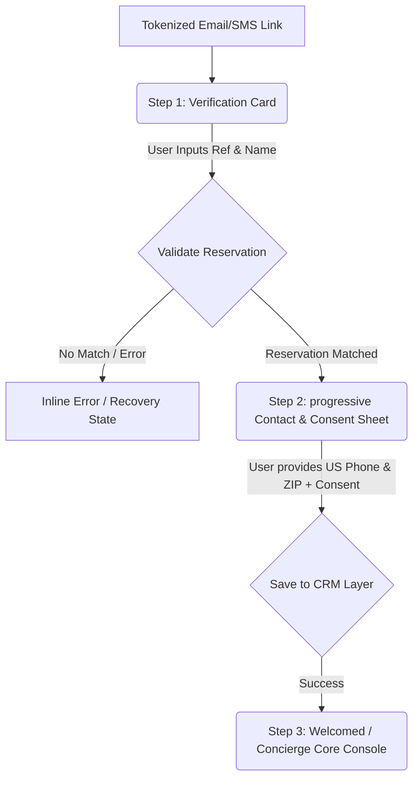

# Guest Portal Verification & Curated Arrival Journey UX

> Status: Draft | Focus: REV-43 (Onboarding & Arrival Journey) | Target Surface: External Guest Portal (Mobile Web)

---

## 1. Product Context & Research Directives

This specification translates product discovery insights into an execution-ready user experience for the zero-install Guest Portal. 

### Core User Challenge
OTA guests are typically in transit, managing luggage, navigating weak airport or highway cell reception, and experiencing high cognitive loads. Native app downloads create critical friction points. To address this, we leverage a zero-install, lightweight mobile web application delivered via a tokenized link in their booking confirmation.

### Progressive Onboarding Philosophy
Instead of overwhelming the guest with long inputs, we split onboarding into two distinct, high-trust steps:
1. **Reservation Match (Look-up)**: Validate their identity using booking-specific references and their last name.
2. **Contact & Consent Capture (Identity Claim)**: Seamlessly collect standard US contact details and capture SMS messaging consent, explaining exactly *why* we need it.

---

## 2. Onboarding Journey Map

---

## 3. Detailed Step-by-Step Flow Specification

### Step 1: Reservation Lookup
* **Objective**: Confirm the user has a valid reservation and match their session to the Property Management System (PMS) record.
* **Layout**: Clear, premium hero typography welcoming them to the hotel (using the serif editorial typography scale). A single container containing the booking reference and last name inputs.
* **Inputs**:
  * **Booking Reference**: 8-character alphanumeric code. Auto-capitalized with blur-validation.
  * **Last Name**: Text input.
* **CTAs**: Primary visual button: "Look Up My Stay".

### Step 2: Contact Capture & Consent Slide-Out
* **Objective**: Establish direct communication by collecting standard US contact details and explicit consent.
* **Layout**: Upon successful verification in Step 1, the `VerificationCard` collapses and a slide-out drawer appears with warm, welcoming copy.
* **Inputs (Restricted to US-Only)**:
  * **US Phone Number**: Formatted input field with automatic masking `+1 (XXX) XXX-XXXX`. 
  * **US ZIP Code**: 5-digit numeric input with a 9-digit fallback pattern.
  * **SMS Opt-In Checkbox**: Highly prominent, custom checkbox.
    * *Copy*: "Keep me updated. Check this box to receive real-time room readiness, mobile key access, and front-desk text support directly to your phone."
* **CTAs**: Primary action: "Enter Guest Portal".

### Step 3: Curated Arrival Gateway
* **Objective**: Immediate deliverable value to reward the user for completing verification.
* **Layout**: Displays their verified room/arrival status, high-priority utility buttons (Wi-Fi password, parking directions, concierge front-desk SMS chat), and a curated 3-spot guide of local recommendations.

---

## 4. Error Handling & Cooldown State Model

* **PMS Match Failure**: Displays a helpful notification "We couldn't locate that booking reference. Please check your confirmation letter or speak with our front desk."
* **Form Validation Errors**: Interactive field highlights in standard error red (`#ef4444`) with descriptive helper text below the field.
* **Brute-Force Protection (Cooldown Lock)**: To prevent brute-force attempts on reservation reference codes, the portal implements a progressive cooldown state:
  * *5 failed matches*: Form locked for 5 minutes.
  * *10 failed matches*: Form locked for 30 minutes, showing a hotlink to call the front desk directly.

---

## 5. Accessibility (WCAG 2.2 AA) Constraints

* **Touch Targets**: All interactive elements (form fields, checkboxes, buttons) must maintain a minimum physical target size of `48px` x `48px` with at least `8px` of separation.
* **Contrast Ratios**: Standard body copy must maintain a minimum contrast ratio of `7:1` against cream backgrounds, and headings must maintain `4.5:1`.
* **Focus States**: Every form field must have a prominent `:focus` outline matching our primary accent gold color with a `2px` ring offset.
