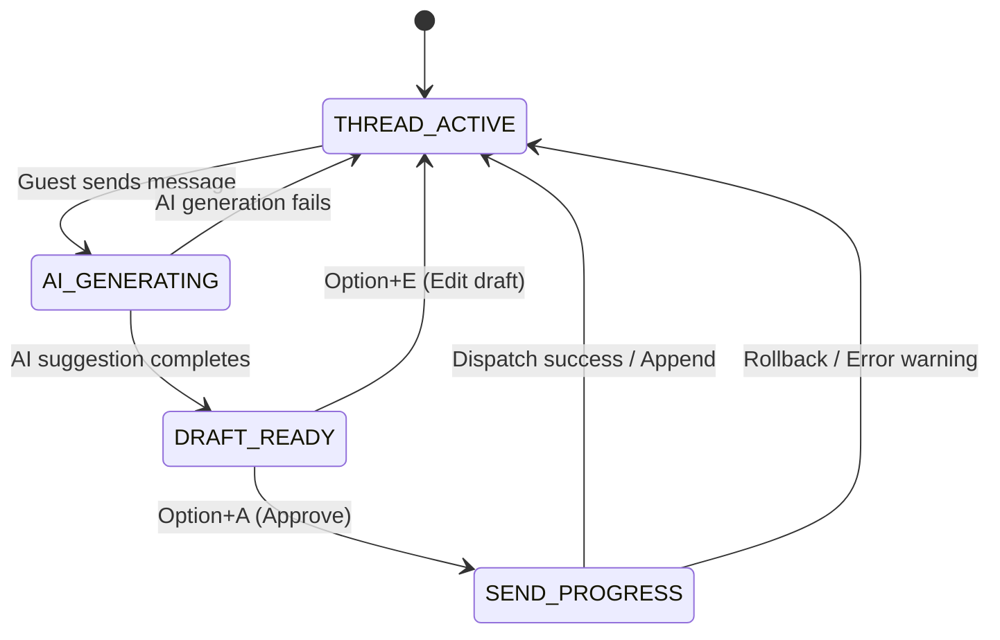

# SLAInboxThread Component Specification

> Focus: REV-46 (SLA Inbox Thread & Operator Hotkeys) | Surface: Internal Admin Console (Desktop-Dense Web) | Platform: React + TypeScript + Tailwind CSS

---

## 1. Component Anatomy & Layout

The `SLAInboxThread` is the central high-density interface used by hotel operators to read, prioritize, and respond to incoming guest messages across various channels (OTAs, SMS, etc.).

```
+-----------------------------------------------------------------------------------------+
| [ VIP Badge ]  Guest: Gary Stringham  |  Room: 402  |  SLA Status: [ 04:12 ] (CRITICAL) |
+-----------------------------------------------------------------------------------------+
| (collapsed history) ...                                                                 |
|                                                                                         |
| [Guest] 15:30 - "Is there parking available on-site?"                                   |
+-----------------------------------------------------------------------------------------+
| [AI Suggested Reply Panel]                                                              |
| "Yes, on-site parking is available for $25/night. Would you like me to reserve a spot?"  |
|                                                                                         |
| [ Option+A ] Approve & Send   |   [ Option+E ] Edit Draft                               |
+-----------------------------------------------------------------------------------------+
| [ Message Input Area ]                                                                  |
| [ Write custom message here...                                                        ] |
|                                                                                         |
| [ Send Message ] (Enter)                                                                |
+-----------------------------------------------------------------------------------------+
```

| Sub-Component | Spacing & Dimensions | Semantic CSS Mapping (Operator Slate) |
|---|---|---|
| **Thread Header** | Height: 64px, Padding: px-6. | `bg-white border-b border-neutral-100 flex items-center justify-between` |
| **SLA Badge** | Padding: px-3 py-1, Rounded-full. | `bg-error-50 text-error font-mono font-semibold text-sm animate-pulse` |
| **AI Suggested Panel** | Padding: p-4, Border radius: lg. | `bg-blue-50/50 border border-blue-100 rounded-lg text-slate-800` |
| **Message History** | Scrollable container, flex-1. | `overflow-y-auto space-y-4 p-6 bg-slate-50` |
| **Input Canvas** | Height: auto, Padding: p-4. | `bg-white border-t border-neutral-100 p-4 space-y-3` |

---

## 2. Finite State Machine (FSM) State Model



---

## 3. SLA Timer Warning Thresholds

To prevent operators from breaching response SLAs (Service Level Agreements), the countdown timer changes states dynamically:

1. **Active State (> 15 mins remaining)**:
   * *Styling*: `#0f172a` (slate-900) text on neutral background.
   * *Status*: Stable.
2. **Warning State (5–15 mins remaining)**:
   * *Styling*: Yellow border (`#aa7c11`) and font weight bold.
   * *Status*: Promoted toward the top of the operator's queue.
3. **Critical State (< 5 mins remaining)**:
   * *Styling*: Red warning background (`#ef4444` error color) with white blinking text.
   * *Status*: Hard-pinned to the absolute top of the messaging queue.

---

## 4. Operator Keyboard Hotkeys

To optimize operator efficiency during high-volume peak-hour check-ins, all primary actions are bound to direct keyboard shortcuts:

| Command Action | Hotkey Shortcut | Engineering Implementation Mapping |
|---|---|---|
| **Approve & Send AI Draft** | `Option + A` | Triggers immediate validation and dispatches payload to backend. |
| **Edit AI Draft** | `Option + E` | Copies suggestion text to input textarea and shifts focus. |
| **Skip AI Suggestion** | `Option + S` | Collapses the AI Panel and shifts focus to custom textarea. |
| **Toggle Thread Lock/Archive** | `Option + L` | Locks the session thread, saving to historic logs. |
| **Navigate to Next Thread** | `Option + DownArrow` | Triggers focus switch on sidebar queue lists. |

---

## 5. Optimistic UI Updates & Failure Recovery

To ensure immediate interaction feedback on poor network setups, we implement an optimistic UI update sequence:

* **Outgoing Append**: On CTA click or `Option + A` trigger, immediately append the message bubble with an opacity of `50%` and a "Sending..." subtitle text.
* **Timeout & Failure Recovery**:
  * If the API fails or takes longer than `8000ms`, shift the optimistic bubble border to red `#ef4444`.
  * Update subtitle text to "Failed to send." and reveal an inline link button "Click to retry" alongside an automatic clipboard fallback.

---

## 6. Accessibility (WCAG 2.2 AA) & Screen Readers

* **Urgent Alerts**: Incoming messages for active or critical threads utilize `aria-live="polite"` on message bubbles to notify assistive technologies without interrupting active keyboard typing.
* **SLA Announcements**: Critical countdowns under 5 minutes issue a one-time live audio warning: `<div aria-live="assertive" class="sr-only">Warning: Thread for Room 402 is under 5 minutes SLA!</div>`.
* **Focus Trap Prevention**: The message queue sidebars and input fields allow continuous tabbing loops without trapping focus. Standard outline offset indicators (`outline: 2px solid #0284c7`) appear on focused operators.
